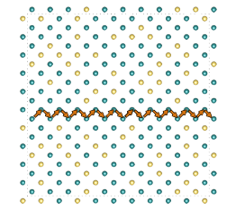
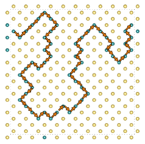

# Crystal Site Connectivity and Tortuosity

Diffusion through crystal structures is of fundmental importance to many problems in material science. One such example is the diffusion of Li+ ions in lithium battery electrodes and solid electrolytes. 

Typically the tortuosity, when defined in the context of ionic conductivity, relates to the transport through porous structures, and is used with a measure of the porosity to scale the bulk diffusion coefficient and thus obtain an effective diffusion coefficient. However porous polycrystalline electrolytes have several potential pitfalls, for example short-circuiting as a result of dendrites forming within the porous electrolyte. Single crystal electrolytes offer a potential solution to this problem [Kataoka-2018], and the diffusion coefficients of these single crystal electrolytes depends upon the crystal site connectivity and crystal tortuousity.

Taking vacancy mediated diffusion of a Li+ dopant through a solid electrolyte as an example, in the case where the atoms of the original crystal lattice are immobile and form blocks on the network of crystal sites. Li+ diffusion in this instance will proceed along the network of connected sites occupied by Li+ and \[Vac\]. Long range diffusion, and therefore the viability of the material as a solid electrolyte, depends on the Li+-\[Vac\] occupied sites forming a percolation network (i.e. the probability of Li+-\[Vac\] site occupancy surpassing the critical percolation threshold). Establishing the connectivity of clusters formed by different doping regimes in this context therefore allows statistics to be generated on the concentration required to surpass this percolation threshold, and provides a computationally inexpensive approach for checkinng if a particular crystal structure is a suitable candidate as a solid Li+ electrolyte. 

The bulk crystal tortuosity, &tau;, can be defined as the ratio of the length of the shortest possible diffusion pathway through the crystal, to the length of the direct path between them. In our case we are considering atoms on crystal sites as our nodes, so the tortuosity may be defined as the number of inter-nodal steps in actual pathway to that in an idealised direct pathway:

 

$$\tau= \frac{n^{steps}_{path}}{n^{steps}_{direct}}$$

# `crystal_torture`

``crystal_torture`` is a Python, Fortran and OpenMP module that enables network analysis to be performed on crystal structures. The code includes an interface with `pymatgen` `Structure` objects [OngEtAl_CompMaterSci2013], allowing graphs to be set-up from crystal structures. These graphs can then be interogated to obtain connected clusters of nodes within the graph, which can be output as `pymatgen` `Structure` objects. It can establish whether these clusters form percolation networks, and the periodicity of the clusters. Finally it can perform a breadth-first-search to calculate the crystal site tortuosity of the percolation networks. 

Also included are simple doping routines which when coupled with the network analysis can be quickly used to build up statistics on the connectivty and tortuousity of particular doping regimes and thereby determine the viability of particular doping strategies in the production of conductive crystals.

 

 

