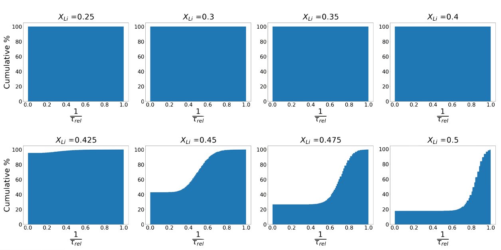

`crystal-torture` is a Python, Fortran, and OpenMP module for the analysis of diffusion networks in crystal structures.

The transport of mobile ions through crystalline solids is a fundamental process underlying a number of phenomena in material, such as solid-state reactions and the behaviour of devices such as batteries and fuel cells. Quantitative descriptions of microscopic ionic transport are often derived by considering ionic trajectories as sequences of discrete &ldquo;hops&rdquo; made by individual ions, as they move between lattice sites in the host crystal structure [@Vineyard_JPhysChemSolids1957; @Catlow_AnnuRevMaterSci1986; @VanDerVenEtAl_AccChemRes2013; @Morgan_RSocOpenSci2017]. In a perfect crystal structure, the crystal symmetry means the full lattice can be constructed by periodically tiling a unit cell, containing only one, or some small number, of lattice sites [@Glazer_IntroductionBook]. In conventional ionic conductors, ion diffusion on this periodic lattice can be modelled as a stochastic random walk, giving simple quantitative relationships between the average microscopic hop rate and macroscopic transport coefficients, such as diffusion coefficient and ionic conductivities [@Catlow_SolStatIonics1983; @Catlow_AnnuRevMaterSci1986; @MorganAndMadden_PhysRevLett2014; @Morgan_RSocOpenSci2017; @MantinaEtAl_PhysRevLett2008]. This model is complicated in highly disordered crystal structures where some proportion of the host lattice sites are occupied by immobile atoms, which block the diffusion of nominally mobile ionic species. The long-ranged diffusion of mobile ions now depends on the proportion and arrangement of blocked sites, and the degree to which the mobile ions can access percolating paths through the crystal structure \[Fig. 1\]  [@GarciaDazaEtAl_ACSApplMaterInter2018; @Rustad_arXiv2016; @DengEtAl_ChemMater2015; @UrbanEtAl_AdvEnergyMater2014; @LeeEtAl_Science2014]. If the proportion of blocked sites, $p_\mathrm{b}$, exceeds $1-p$, where $p$ is the site-percolation threshold for that crystal lattice, then no continuous paths exist and the diffusion coefficient and ionic conductivity for the mobile ions are zero. If the proportion of blocked sites falls below this threshold; $0<p_b<1-p$; at least one percolating path exists and the mobile-ion transport coefficients are non-zero, but decreased relative to the corresponding values for the ideal fully open lattice. This decreased ion mobility has two causes. First, the available continuous paths are more *tortuous* than in a more open lattice: a mobile ion must move through more lattice sites to diffuse an equivalent end-to-end distance. Second, some mobile ions may be trapped in non-percolating paths, and can not contribute to long-ranged transport.

![Schematic showing the effect of progressively blocking lattice sites on ion diffusion pathways. (a) ideal lattice: all lattice sites are accessible and ions follow a random walk. (b) partially blocked lattice: Long ranged diffusion is still possible, but diffusive pathways are tortuous (blue arrows). Not all mobile ions can participate in long-ranged diffusion (orange arrows). (c) fully blocked lattice: The proportion of available sites is below the site percolation threshold. No long ranged diffusion is possible.](Images/lattice_blocking.pdf)

`crystal-torture` allows the calculation of site-connectivity statistics for crystal lattices containing blocked sites. 

The concept of *tortuosity* has been extensively used in modelling macroscopic transport through porous media [@GhanbarianEtAl_SoilSciSocAmJ2013; @ShenAndChen_ChemEngSci2007]. `crystal-torture` allows the calculation of &ldquo;microscopic tortuosities&rdquo;, which we define for each lattice site as the length of the shortest possible path between a that site and its periodic images, divided by the minimum-image distance in the corresponding ideal (unblocked) lattice. If all lattice-lattice jumps are of equal distance, the microscopic tortuosity can equivalently be defined as the minimum number of inter-nodal steps between a pair of site periodic images, divided by the minimum number of steps between these sites in an ideal lattice:

$$\tau^\mathrm{micro}_i= \frac{\min n_{i\to i^\prime}}{\min n^\mathrm{ideal}_{i\to i^\prime}}$$

The microscopic tortuosity is a microscopic analogue of the &ldquo;geometric tortuosity&rdquo; [@Clennell_GeogSocLon1997].

understand the effect of porous structures on macroscopic Typically the tortuosity, when defined in the context of ionic conductivity, relates to the transport through porous structures, and is used with a measure of the porosity to scale the bulk diffusion coefficient and thus obtain an effective diffusion coefficient. However porous polycrystalline electrolytes have several potential pitfalls, for example short-circuiting as a result of dendrites forming within the porous electrolyte. Single crystal electrolytes offer a potential solution to this problem [@Kataoka-2018], and the diffusion coefficients of these single crystal electrolytes will depend upon the crystal site connectivity and crystal tortuousity.

Taking vacancy mediated diffusion of a Li$^+$ dopant through a solid electrolyte as an example, in the case where the atoms of the original crystal lattice are immobile and form blocks on the network of crystal sites. Li$^+$ diffusion in this instance will proceed along the network of connected sites occupied by Li$^+$ and \[Vac\]. Long range diffusion, and therefore the viability of the material as a solid electrolyte, depends on the Li$^+$-\[Vac\] occupied sites forming a percolation network (i.e. the probability of Li$^+$-\[Vac\] site occupancy surpassing the critical percolation threshold). Establishing the connectivity of clusters formed by different doping regimes in this context therefore allows statistics to be generated on the concentration required to surpass this percolation threshold, and provides a computationally inexpensive approach for checking if a particular crystal structure is a suitable candidate as a solid Li$^+$ electrolyte. 

<!--  -->
<!--  -->

The relative bulk crystal tortuosity, $\tau_\mathrm{rel}$, can be defined as the ratio of the length of the shortest possible diffusion pathway through the crystal from a site to its periodic image, to the length of the direct path. In our case we are considering atoms on crystal sites as our nodes, so the tortuosity may be defined as the number of inter-nodal steps between two periodic site images in the actual pathway to that in an idealised direct pathway:

$$\tau_\mathrm{rel}= \frac{n^\mathrm{steps}_\mathrm{path}}{n^\mathrm{steps}_\mathrm{direct}}$$

# `crystal-torture`

`crystal-torture` is a Python, Fortran and OpenMP module that enables network analysis to be performed on crystal structures. The code includes an interface with `pymatgen` `Structure` objects [@OngEtAl_CompMaterSci2013], allowing graphs to be set-up from crystal structures. These graphs can then be interogated to obtain connected clusters within the graph, which can be output as `pymatgen` `Structure` objects. The code can check if these clusters are periodic across the crystal structure, calculate the periodicity, and therefore establish whether these clusters form percolation networks. 

It can perform a breadth-first-search to calculate the crystal site tortuosity of the percolation networks: for each site in a periodic cluster the code can calculate the shortest possible pathway for a diffusing ion on this site to pass through the crystal and return to a periodic image of the site. This is the metric for establishing the tortuosity of the site.

Also included are simple doping routines which when coupled with the network analysis can be quickly used to build up statistics on the connectivty and tortuousity of particular doping regimes, and thereby determine the viability of particular doping strategies in the production of conductive crystals. 

For example, in a potential solid electrolyte in which doping with Li results in symmetrically inequivalent structures, we can take a large set of randomly doped structures at a given concentration and examine the connectvity and site tortuosity to produce the data in Figure 2.

An inverse tortuosity value of 0 tells us there are no percolation networks formed, while a value of 1 tells us there are direct routes through the crystal. From the data produced we can see that in order for the percolation threshold to be crossed, the dopant concentration $x_\mathrm{Li}\approx0.425$, and even for this high concentration very few of the Li ions are in percolation networks. Performing this analysis  provides a simple and quick way of establishing whether a potential material is viable as an ionic conductor.

# Acknowledgements

This work was funded by EPSRC Grant No. EP/N004302/1, and was supported with funding from the Faraday Institution ([faraday.ac.uk](http://faraday.ac.uk); EP/S003053/1), grant number FIRG003.
B.J.M. acknowledges support from the Royal Society (UF130329).

# References
